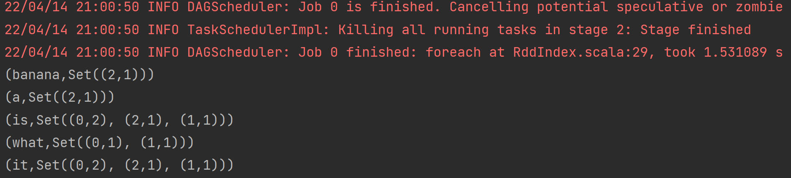
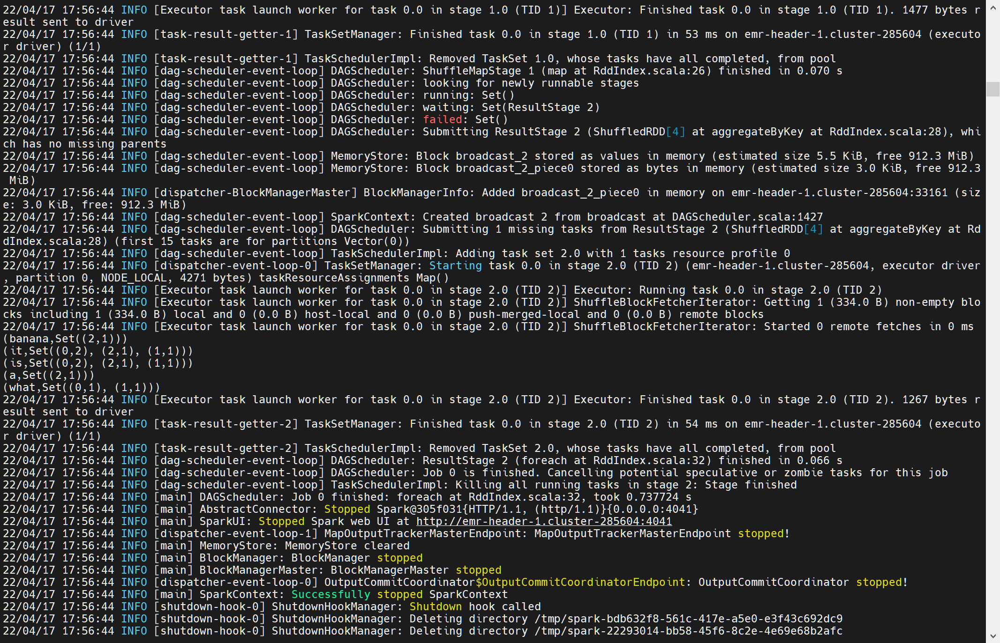
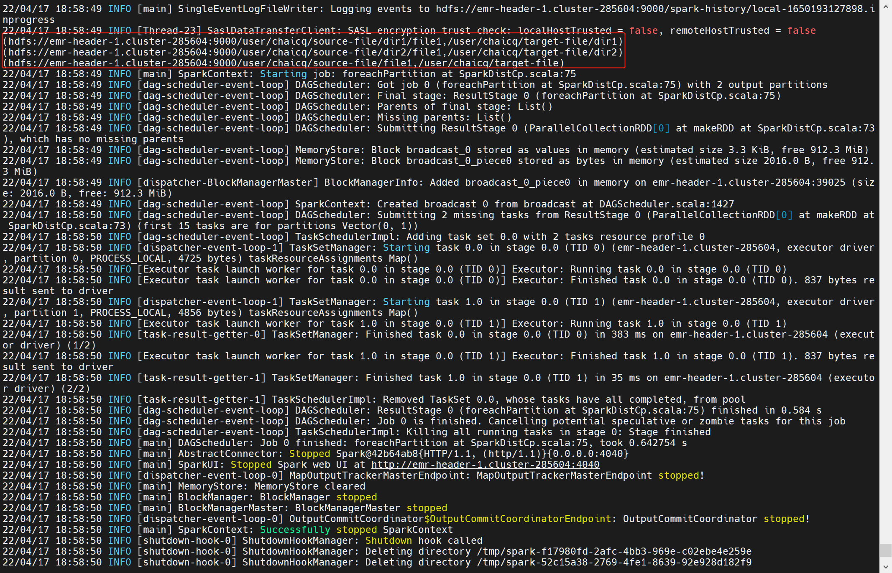

# sparkTask

* 题目一：倒排索引RDD

RddIndex.scala核心代码

```scala
val rdd = sparkSession.sparkContext.parallelize(Seq(
      (0, "it is what it is"),
      (1, "what is it"),
      (2, "it is a banana"),
    ))

    rdd.flatMap(row => {
      row._2.split(" ").map(r => ((row._1, r), 1))
    }).reduceByKey(_+_).map(r => {
      (r._1._2, (r._1._1, r._2))
    }).aggregateByKey(collection.mutable.HashSet[(Int, Int)]())((S, e) => {
      S += e
    }, (S1, S2) => {
      S1 ++= S2
    }).foreach(println(_))
```
本地执行结果


spark-submit提交命令
```shell
spark-submit --class org.bigdata.sparkjob.RddIndex --master local /home/student3/chaicq/sparkJob/SparkJob-1.0-SNAPSHOT.jar
```
集群执行截图


* 题目二：Distcp 的 Spark 实现（模仿老师代码）

SparkDistCp.scala核心代码

```scala
    val parser = new scopt.OptionParser[SparkDistCpOption]("SparkDistCp") {

      opt[String]("src") action { (x, c) => c.copy(src = x) } text ("source path")
      opt[String]("dst") action { (x, c) => c.copy(dst = x) } text ("destination path")
      opt[Int]("m") action { (x, c) => c.copy(partitionNum = x) } text ("max concurrence")
      opt[Boolean]("i") action { (x, c) => c.copy(ignoreFailure = x) } text ("ignore failures")
    }

    parser.parse(args, SparkDistCpOption()) match {
      case Some(option) =>
        val src = new Path(option.src)
        val dst = new Path(option.dst)

        val fileList = mkDir(sparkSession, src, dst, option)

        fileList.foreach(tuple => println(tuple))

        copy(sparkSession, fileList, option)
      case _ =>
        throw new RuntimeException("Failed to parse arguments")
    }
```

对应mkdir和copy的实现为：
```scala
  def mkDir(sparkSession: SparkSession, src: Path, dst: Path, option: SparkDistCpOption): ArrayBuffer[(Path, Path)] = {
    val fileList: ArrayBuffer[(Path, Path)] = new ArrayBuffer[(Path, Path)]()

    val fs = FileSystem.get(sparkSession.sparkContext.hadoopConfiguration)
    fs.listStatus(src).foreach(curPath => {
      if (curPath.isDirectory) {
        val subPath = curPath.getPath.toString.split(src.toString)(1)
        val nextDstPath = new Path(dst + subPath)
        try {
          fs.mkdirs(nextDstPath)
        } catch {
          case e: Exception =>
            if (option.ignoreFailure) println(e.getMessage) else throw e
        }
        fileList.appendAll(mkDir(sparkSession, curPath.getPath, nextDstPath, option))
      } else {
        fileList.append((curPath.getPath, dst))
      }
    })
    fileList
  }

  def copy(sparkSession: SparkSession, fileList: ArrayBuffer[(Path, Path)], option: SparkDistCpOption): Unit = {
    val sc = sparkSession.sparkContext
    val partitionNum = Some(option.partitionNum).getOrElse(1)
    val pathRdd = sc.makeRDD(fileList, partitionNum)

    pathRdd.foreachPartition(part => {
      val hadoopConf = new Configuration()
      part.foreach(tuple => {
        try {
          FileUtil.copy(tuple._1.getFileSystem(hadoopConf), tuple._1,
            tuple._2.getFileSystem(hadoopConf), tuple._2,
            false, hadoopConf)
        } catch {
          case e: Exception =>
            if (option.ignoreFailure) println(e.getMessage) else throw e
        }
      })
    })
  }
```

spark-submit提交命令
```shell
spark-submit --class org.bigdata.sparkjob.SparkDistCp --master local /home/student3/chaicq/sparkJob/SparkJob-1.0-SNAPSHOT.jar --src /user/chaicq/source-file --dst /user/chaicq/target-file --m 2
```
集群执行截图

